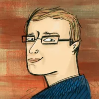
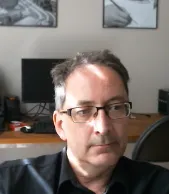
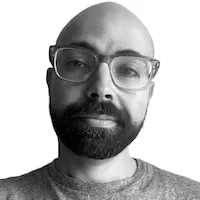

---
hide:
  - toc
---

Chris Cumming
-------------
{: style="width:150px;float: left;padding-right: 10px;"}

Chris's first computer was a Commodore 64, but he didn't realize the true power of computers until he discovered he could create his own Doom levels. While he still enjoys computer games, his focus has shifted to helping businesses ship high-quality secure software faster via [Saturday Morning Productions](https://saturdaymp.com/).

Chris also founded and hosts the [Weekly Dev Chat](http://weeklydevchat.com/) every Tuesday at 12pm MT. He also co-hosts the [Legacy Code Rocks Virtual Meetup](https://www.legacycode.rocks/) every Wednesday at 11am MT. Everyone and anyone, including you, are welcome to join either as long as you are kind, supportive, and respectful of others.

Norm Lorrain
------------
{: style="width:150px;float: left;padding-right: 10px;"}

I have degrees in EE and CS and have worked in industries from broadcast communications to nuclear power to SCADA. Currently call myself semi-retired, working part-time as an IT manager at a local healthcare clinic. Our first computer was a Heathkit HS-151, in 1984, programmed in GW-Basic and Turbo Pascal. My first IT summer job was writing Cobol code on an HP mainframe terminal. I love to work with embedded systems and have worked mostly in C and C++. These days I usually program in Python. I'm curious about many things; YouTube's algorithm has a hard time with me 😏.

Omar Ashour
-------------
{: style="width:150px;float: left;padding-right: 10px;"}

Omar is a full‑stack developer who believes great software should sing, just like a well‑written melody. A trained musician and economics graduate, Omar fuses creative UI craftsmanship with a data‑driven focus on ROI. As a software developer, he’s delivered performance‑driven products and helped a SaaS platform reach $1 M ARR in under two years. Besides co-hosting the Weekly Dev Chat with Chris and Norm, he takes part in ethical hacking with [YegSec CTF](https://ctftime.org/team/109674). Beyond programming, he enjoys chess, football (i.e. soccer) and spending time with his family. 

##### Also, a big thank you to our past hosts whose information you can find [here](../past-hosts/index.md).
