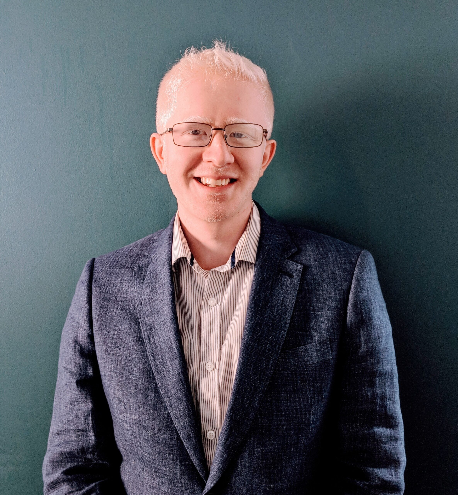
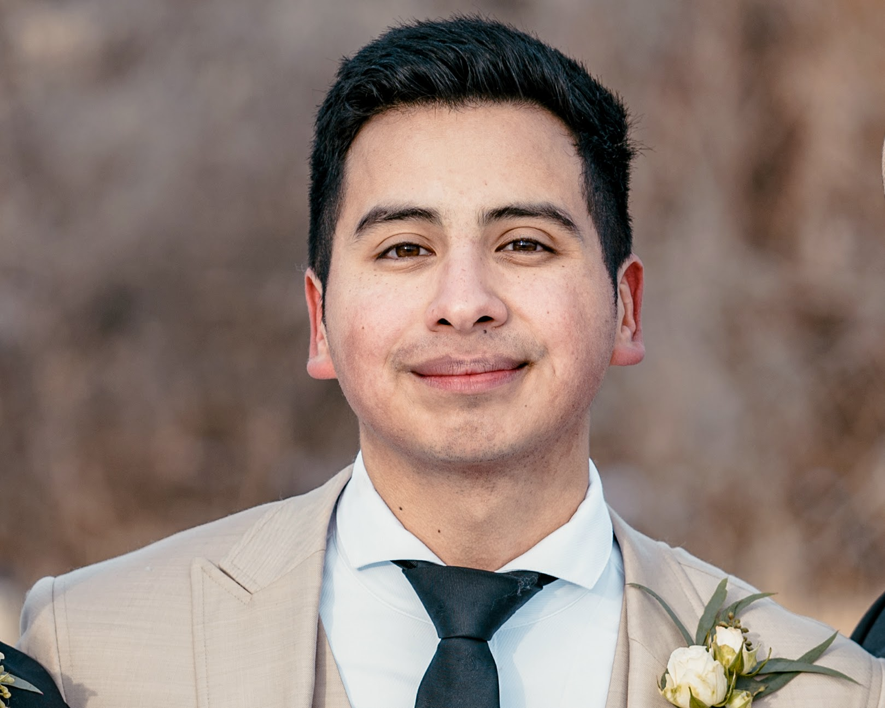
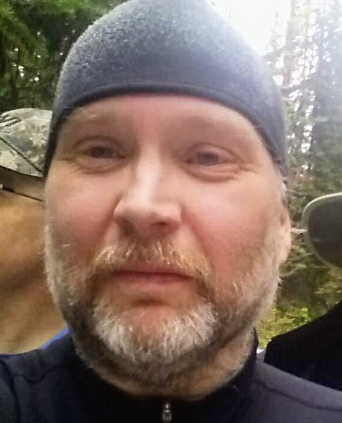
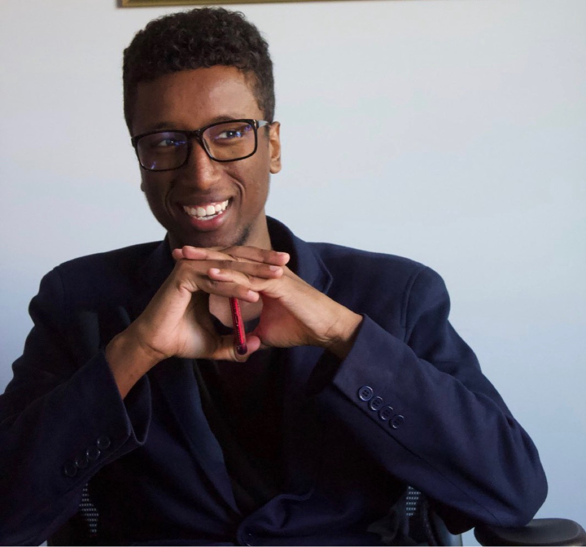

# Past Hosts

### A big thank you to our past hosts.  We appreciate you volunteering your time and energy!

##  Azal Abedi

{: style="height:150px;width:150px"}

Azal is a self-taught developer who started to learn to code during the middle of the pandemic. His formal background comes from a Bachelor of Commerce degree in Management from MacEwan University and 7 years in the private post-secondary education industry. He enjoys sharing knowledge he gained on his journey from solo-learning to actual on-the-job tech experience with the local developer community, however, he can. As of September 2021, Azal has been working as a developer at Go Auto.

[LinkedIn](https://linkedin.com/in/azalabedi/)

##  Hugo Palomera

{: style="height:150px;width:150px"}

Hugo is a back-end developer working at samdesk.io. He enjoys working with AWS, Terraform and Python, but also enjoys connecting with like-minded individuals and is always open to engaging in coffee chats to exchange knowledge and experiences. Don't hesitate to reach out to him; he welcomes opportunities to connect with new people and foster meaningful connections within the industry.

## Dale Hagglund

{: style="height:150px;width:150px"}

My first paid programming job was a summer job for my high school, from which I learned that (a) good variable names are important, (b), algorithms are cool, and (c) you shouldn't bid a fixed-price contract. After high school, I received as B.Sc. in Computer Science (1986) from the University of Alberta and an M.Sc. in Computer Science (1988) from the University of Victoria.

I have worked on “close-to-the-hardware” projects including high-performance networking, i/o, and computing systems for most of my career. However, I am now at INVIDI Technologies working on software to help content distributors and providers make the best use of their available ad spots.

I enjoy writing software and talking and thinking about how to write software better.

[LinkedIn](https://linkedin.com/in/dalehagglund)

## Birm Wais

{: style="height:150px;width:150px"}

I got into programming because I wanted to build an app for this startup idea I had. Turned out the app idea was terrible, but learning to code wasn't. I'm still hacking around on projects and attempting to build Startups, but I also work as a full-stack developer at Punchcard Systems.

[LinkedIn](https://linkedin.com/in/birm/)