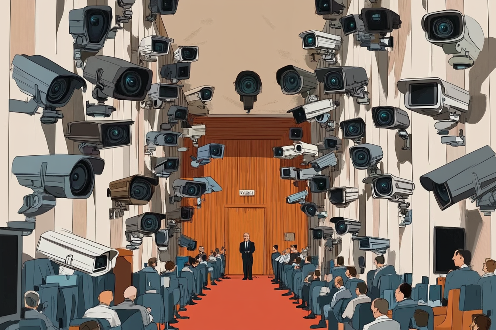

The initial topic is security in general. I'll be hosting live from BSides and hopefully there won't be an technical details. Looking forward to chatting about what I've learned at BSides and any security topics we haven't touched on during this month.

September's security theme schedule:

Sep 3rd: OWASP Top 10. Focus on how to prevent the issues listed.  
Sep 10th: PicoCTF exercises.  
Sept 17th: Privacy. Does it matter anymore? What to store, not to store.  
Sep 24th: Live from BSides (maybe?)

Learn how to join the chat, and other useful information, [here](https://weeklydevchat.com/). Everyone and anyone is welcome to join as long as you are kind, supportive, and respectful of others.

