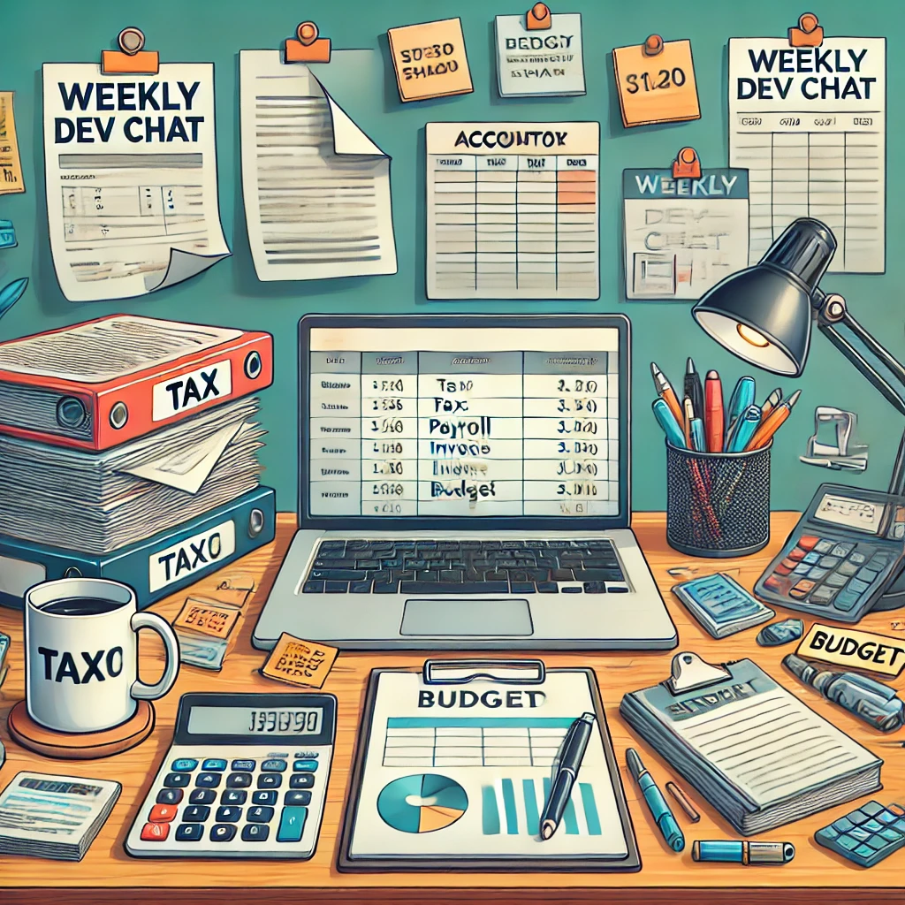

What non-development tasks are required to run a business and/or a household that aren't fun but required?  Taxes, budgeting, paying bills, managing subscriptions, HR, contracts, certification, and likely others.  When do you need professional help such as a lawyer or accountant?  Have you been able to automate some of these tasks?

The theme for November is business side of software development with a focus on employees, consultants, freelancers, and small business owners:

- Nov 5th - Marketing: Building your personal or company brand

- Nov 12th - Accounting: Taxes, payroll, and other boring but necessary tasks

- Nov 19th - Profit: Increasing income and reducing expenses

- Nov 26th - Values: What do you value more then money?

Everyone and anyone is welcome to join as long as you are kind, supportive, and respectful of others. Learn how to join the chat, and other useful information, [here](https://weeklydevchat.com/).

