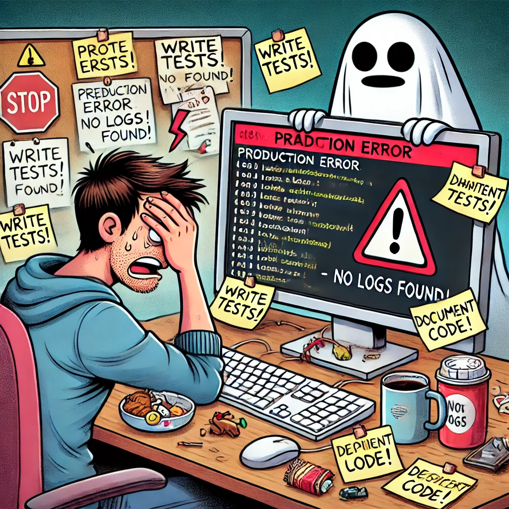

Join us Feb 25th, 2025 as we discuss our worst software development habits. What is one software development best practice you know you should do but don’t? A best practice you know you need to improve? Spoiler alert, but for me it’s logging. I always forget to add logging to my code and then struggle when a production error occurs, but I can’t debug it in my development environment.

Everyone and anyone are welcome to join as long as you are kind, supportive, and respectful of others. Learn how to join the chat, and other useful information, [here](/join/).

