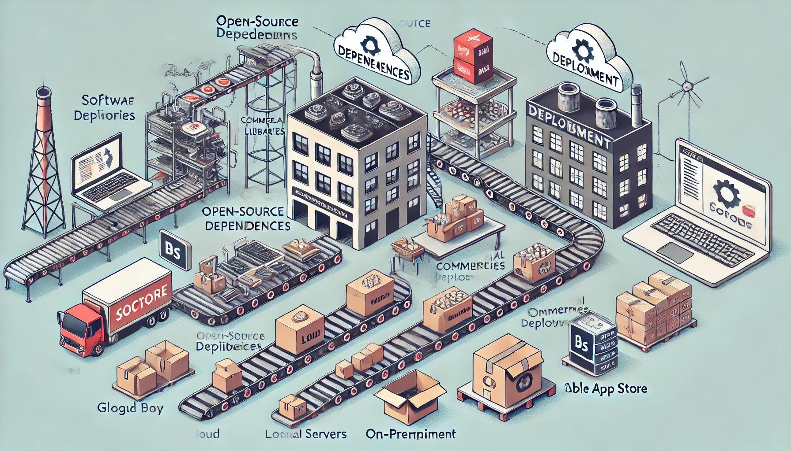

Today we're discussing software development supply chains. For example, are your dependencies completely open source, or do you buy commercial libraries?   Do you rely on tools like Balsamiq, or Adobe Photoshop/Illustrator? Are you deploying your software in the cloud or on-site? Do you sell your work in any of the app stores?

Everyone and anyone are welcome to join as long as you are kind, supportive, and respectful of others. Learn how to join the chat, and other useful information, [here](/join/).

