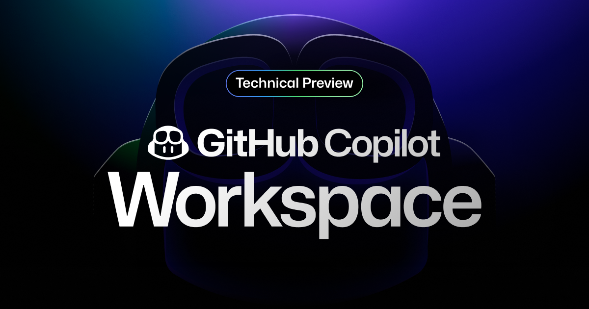

In this Weekly Dev Chat (March 25/2025) we will experiment with [GitHub Copliot Workspace](https://githubnext.com/projects/copilot-workspace).  It's a feature that lets you create PRs using GitHub Copilot that will create new files, edit eixisting files, and the like.  I'll share my screen and we can do some ~~pair programming~~ pair telling the AI what do.

Everyone and anyone are welcome to [join](../../../../join.md) as long as you are kind, supportive, and respectful of others.

