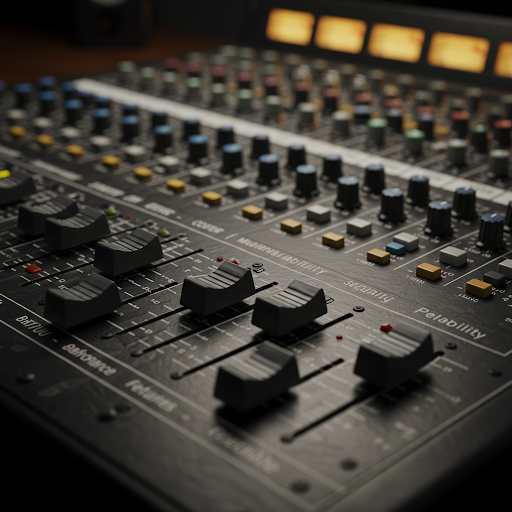

There's an old saying: “Good. Fast. Cheap. Pick Any Two.” In any work we do, priorities shape the outcome. What priorities guide you? Are you balancing quick results over technical debt? Features over performance? How do you strike a balance between these? Here's a list (unordered 😊), what would you modify? What drives your priorities?

* UX/UI Design
* Maintainability
* Quick Results (Speed to Market)
* Performance
* Security
* Cost Efficiency
* Feature Completeness
* Team Productivity (Developer Experience)
* Innovation and Experimentation
* Reliability and Stability

Everyone and anyone are welcome to [join](../../../../join.md) as long as you are kind, supportive, and respectful of others.

