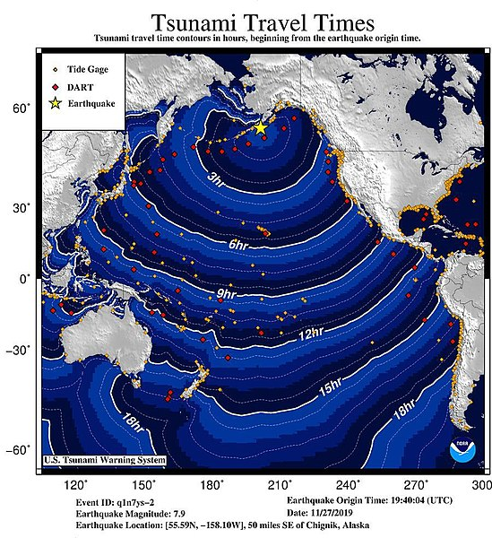

“The trick is not to skate where the puck is, but to skate where the puck is going.” This is Wayne Gretzky quoted in an [article from IndustryWired](https://industrywired.com/ten-big-global-challenges-technology-could-solve/) in March 2019. The article highlights our urgent global challenges and advocates for technology as a solution. It presents solutions like:

* Carbon Capture
* Grid-Scale Energy Storage
* Universal Flu Vaccines
* Earthquake Prediction 

What are your views on technology’s role in addressing the big global issues? Does tech offer the most effective approach? Are there negative side-effects to always leaning on tech for solutions to such problems?

Everyone and anyone are welcome to [join](../../../../join.md) as long as you are kind, supportive, and respectful of others.

