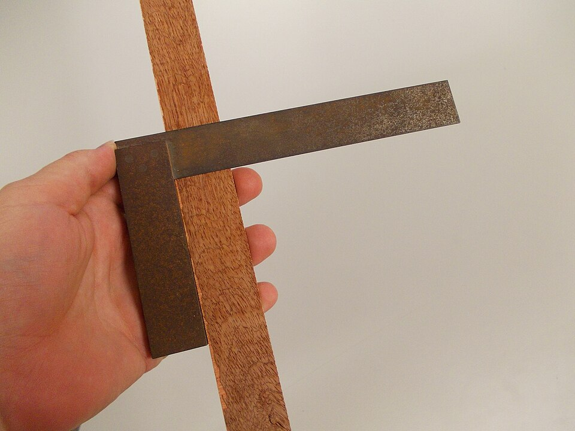

What are your favourite tools that you can’t imagine working without? This could include linters, IDE extensions, browser extensions, libraries, CLI shortcuts, or whatever else. Are these tools primarily for improving productivity, enhancing communication, or maintaining sanity? Or do you prefer more traditional methods like pen and paper?

Everyone and anyone are welcome to [join](../../../../join.md) as long as you are kind, supportive, and respectful of others.

