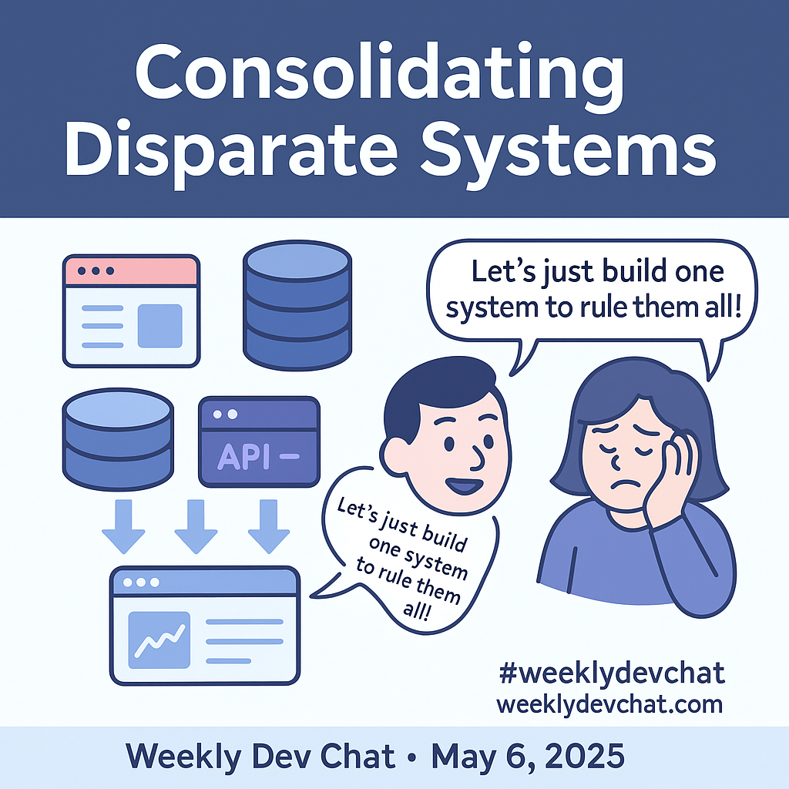

The topic for the May 6th, 2025 chat is consolidating systems.  Organizations often have data and business logic in several different databases and applications.  They would like to have everything in one place, which is a noble goal but hard to achieve.

How do you consolidate these disparate systems?  How do you avoid creating an extra system and avoid the [XKCD standards problem](https://xkcd.com/927/) (substitute application for standards).

Everyone and anyone are welcome to [join](../../../../join.md) as long as you are kind, supportive, and respectful of others.

