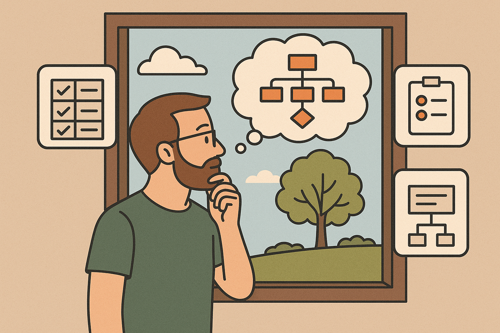

As a developer, have you noticed that you approach life differently than "normal" people? After all those years of training and career, do you think differently than how you used to?

In other words, do you approach non-coding problems like code? 

Some examples: 

* Breaking problems into parts, like modular code:  e.g. you plan a trip by organising flights and hotels like modules.  
* Spotting reusable patterns:  e.g. you standardise meeting agendas using templates.  
* Debugging:   e.g. you troubleshoot a friend's wifi by methodically working from the edge to the ISP.  

Are these shifts unique to coding?  Do they make life better or just annoy those around you?

Everyone and anyone are welcome to [join](https://weeklydevchat.com/join/) as long as you are kind, supportive, and respectful of others. 

