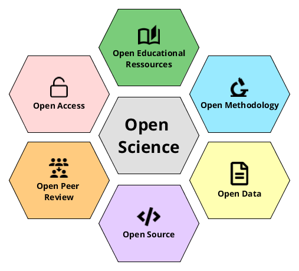

96% of software today uses open source code. Tech giants build billion-dollar empires on volunteer-maintained foundations. OpenSSL is encryption software that secures an estimated 66% of web traffic. So the internet runs on code secured by just 18 underpaid engineers.

Open source also has its dark side, like when Meta's AI model leaked to 4chan within a week.

Does democratizing powerful technology also democratize its misuse?

Everyone and anyone are welcome to [join](https://weeklydevchat.com/join/) as long as you are kind, supportive, and respectful of others. Zoom link will be posted at 12pm MDT.

