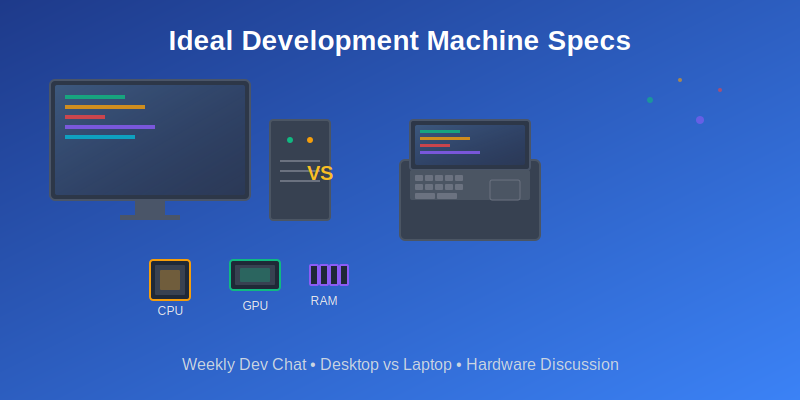

Hello Everyone! Today we are going to discuss the specs for your ideal development machine. Do you prefer a desktop or a laptop? How much RAM, hard drive space, CPU, and other resources do you use during normal development? Is it worth it to getting an AI CPU or GPU? AMD or Intel CPU?

Inspired by the fact I need to upgrade my desktop. I only dive into the world of hardware when I need to upgrade, which is every 5 years or so, and just started my research for my new desktop.

Everyone and anyone are welcome to join as long as you are kind, supportive, and respectful of others. Zoom link will be posted at 12pm MDT.

P.S. - As usual the header image was generated by AI, this time with Claude.