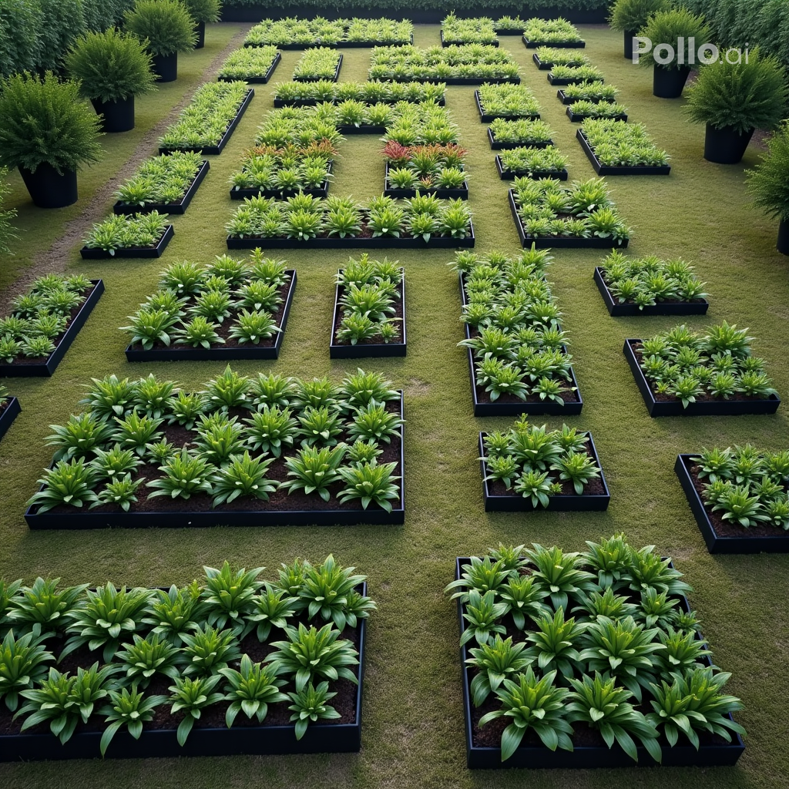

There are plenty of analogies comparing software development to art, writing, bridge building, house construction, and more. While out for a walk last night, I noticed weeds taking over the neighbourhood. This got me thinking about debugging as weeding. Sure enough, [I'm not alone](https://www.surton.com/software-is-a-garden/).  

Sometimes these analogies are helpful; sometimes they're not. What's your preferred analogy? How does it help? Where does it fall short?

Everyone is welcome to [join](https://weeklydevchat.com/join/) as long as you are kind, supportive, and respectful of others. Zoom link will be posted at 12pm MDT.

