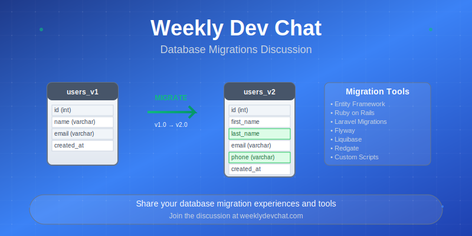

Today's chat is about database migrations, inspired because I need to find a database migration fool for a client and can't use Entity Framework for various reasons.

Are you using a framework that provides database migrations like Ruby on Rails, Entity Framework, Laravel? A third-party tool like Redgate, Flyway, or Liquibase?  Something else?

What do you like about the tool you are using?  If you aren't using a tool how do you manage database changes?  Do you have a DBA that manages the database or is done by developers?

Everyone is welcome to [join](https://weeklydevchat.com/join/) as long as you are kind, supportive, and respectful of others.

P.S. - As usual, AI generated the header image, this time with Claude.