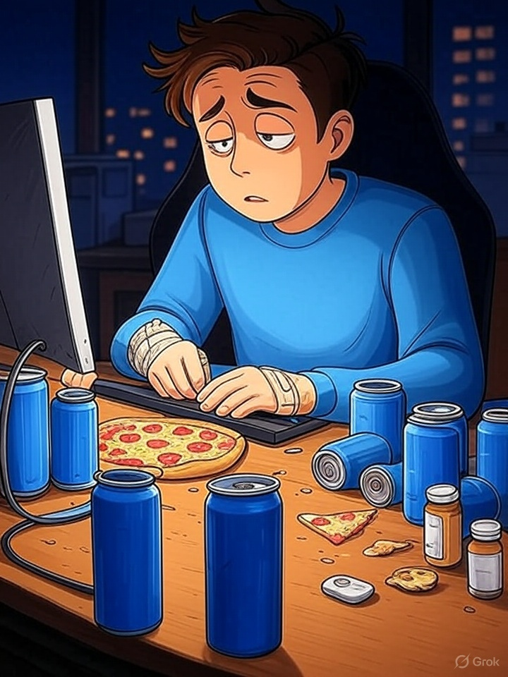

Software development can present its own set of healthcare challenges. Physically, poor ergonomics can lead to repetitive stress injuries (e.g., carpal tunnel syndrome), poor posture, vision problems, headaches, and more. Mentally, long hours and high stress levels can take a significant toll.

How do you maintain your health while you work? If you’re further along in your career, what adaptations have you made?

Everyone and anyone are welcome to [join](https://weeklydevchat.com/join/) as long as you are kind, supportive, and respectful of others. Zoom link will be posted at 12pm MDT.

