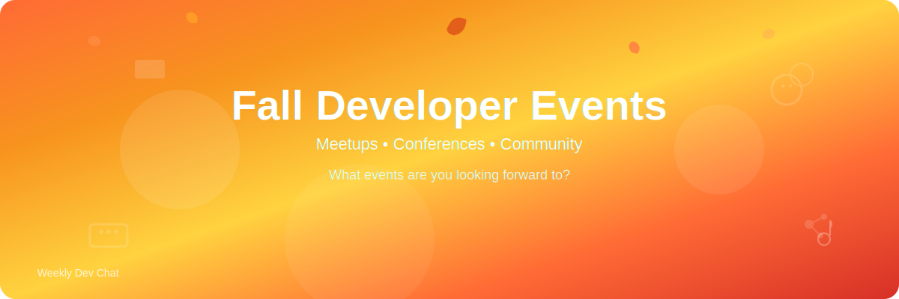

Fall is here!  While that means back to school and work, it also means meetups and other conferences and events.  What events are you looking forward to?  Any you would recommend?  Should I get off my lazy butt and host another Weekly Dev Chat In-Real Life event?  

P.S. - We're Going to be Friends is, I mean was, the only song I could play on guitar and sing poorly at the same time.  It is surprisingly hard to do both at the same time.  

> We're Going to be Friends by The White Stripes 
>  
> Fall is here, hear the yell  
> Back to school, ring the bell  
> Brand new shoes, walking blues  
> Climb the fence, books and pens  
> I can tell that we are gonna be friends  
> I can tell that we are gonna be friends  

Not the official music video but one I think [this](https://www.youtube.com/watch?v=IbLz9-riRGM) video captures the spirit of the song.