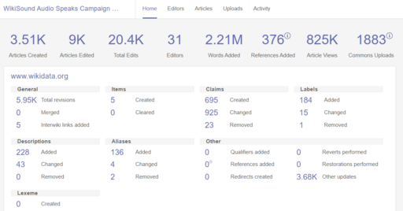

Metrics are everywhere, but people tend to be divided on their real value and when they should be used. In this week's Weekly Dev Chat, we'll try to answer:

- What characteristics make a metric “good” (e.g., relevance, measurability, actionability)?
- Which common metrics tend to become “noise” or vanity stats?
- How can teams spot metrics that sound impressive but don’t drive improvement?
- Which metrics are most effective for comparing competing technologies (speed, resource usage, developer productivity, etc.)?
- What safeguards do you put in place to avoid gaming or over‑optimizing a single number?

Everyone is welcome to [join](https://weeklydevchat.com/join/) as long as you are kind, supportive, and respectful of others.

