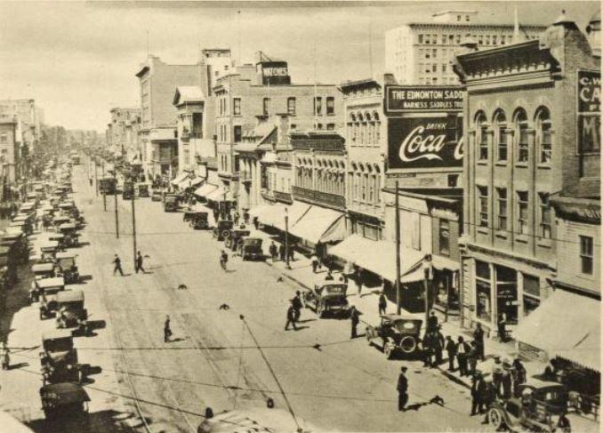

Today we’re taking a quick tour of Edmonton’s tech journey, from the dial‑up ISP garages of the late ’90s, through the SaaS boom that gave us D2L and Benevity, to the AI‑driven labs and remote‑first studios shaping our scene now. 

I’d love to hear your personal snapshots along the way; what kept you up at 2 am troubleshooting a server, the moment you decided to chase venture funding, or the tools that helped you stay connected when the office went virtual. 

Let’s dive in!

Everyone and anyone are welcome to [join](https://weeklydevchat.com/join/) as long as you are kind, supportive, and respectful of others.

