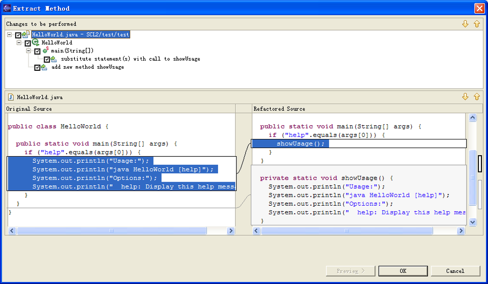

Kent Beck, creator of XP and an early proponent of Agile, has said, “I’m not a great programmer; I’m just a good programmer with great habits.”

Do you relate to this take? Do you have any great habits of your own when programming? Do you have some bad habits that you have picked up along the way or see some in other programmers?

Everyone and anyone are welcome to [join](https://weeklydevchat.com/join/) as long as you are kind, supportive, and respectful of others.

