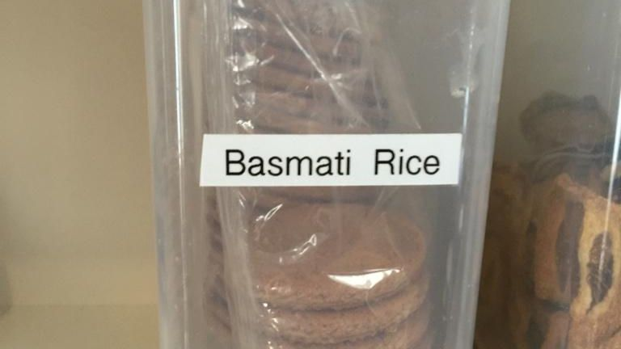

In today's (2026-01-27) chat we will discuss  names. 

In Clean Code (Robert C. Martin), naming variables, functions, classes, and other structures is compared to naming a child. Yet we still see placeholders like x, tmp, or d littered throughout codebases.

How do you approach naming?
• Do you iterate endlessly? write → delete → rewrite—until the name feels perfect?
• Do you drop a quick name and come back to refactor later?
• Or do you stick with the first name and tell others to stop “wasting time” on naming?

Everyone and anyone are welcome to [join](https://weeklydevchat.com/join/) as long as you are kind, supportive, and respectful of others.

