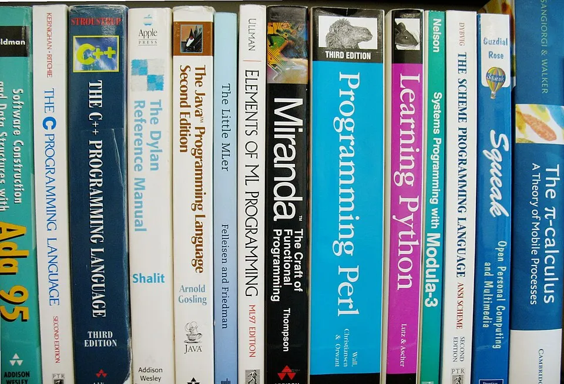

How do you decide which language to use when starting a fresh project? Some follow the adage "new project—old language, old project—new language." But what's your approach?

Some points to discuss:

- Decision criteria and heuristics for language selection
- How to balance comfort with growth
- Learning fatigue vs. focused depth: navigating the challenge of learning a new language PLUS building a new project simultaneously

Everyone and anyone is welcome to [join](https://weeklydevchat.com/join/) as long as you are kind, supportive, and respectful of others.

