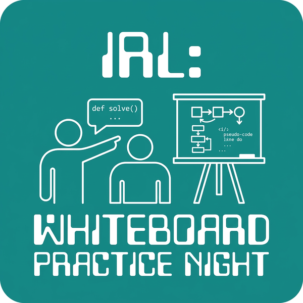

Join Weekly Dev Chat for a whiteboard practice night focused on explaining your thinking clearly while solving coding problems — a skill that matters in interviews and on the job.

This is **not** about speed or perfection. We'll work through junior-friendly, approachable coding problems while practicing how to:

- Understand the problem and build a solid mental model
- Ask clarifying questions and state assumptions
- Talk through your approach step-by-step
- Explain tradeoffs (even for simple solutions)
- Stay calm and communicate when you get stuck

The hosts will demo 1–2 example problems first, then attendees can volunteer to take a turn (whiteboard/interview style). **Participation is optional** — watching and learning is totally welcome.

The event runs on Wednesday, March 25 from 6:30 PM to 8:30 PM at Edmonton Public Library – Strathacona. Light snacks and refreshments will be provided. Register and view full details on Luma:

[https://luma.com/hcsxff11](https://luma.com/hcsxff11)

*Nano Banana created the header image based on a previous variant of the WDC logo I designed.
