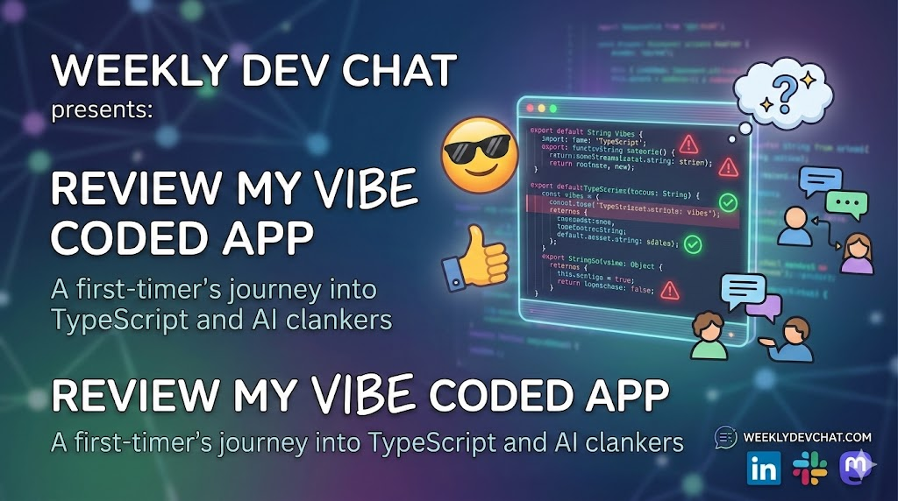

In today's (2026-03-17) chat I'll get the chat mob to review my 99% vibe code [Word Games is Dumb](https://wordgamesisdumb.netlify.app/) app and/or vibe code some more of it.  This is the first application I've vibe coded and accepted most of the clanker (AI) recommendations unless they were really dumb.  It's in TypeScript which is a language I'm not familiar with, so I'm curious to hear what TypeScript experts think of the generated code.

I found the clanker was good at quickly creating a proof of concept (PoC) for my game ideas.  For example, I had one idea that I PoC in an afternoon, tried for a couple days, then ditched it.

Everyone and anyone are welcome to [join](https://weeklydevchat.com/join/) as long as you are kind, supportive, and respectful of others. Zoom link will be posted at 12pm MDT.

P.S. - Image was created using Nano Banana.  I love how the text is repeated.

