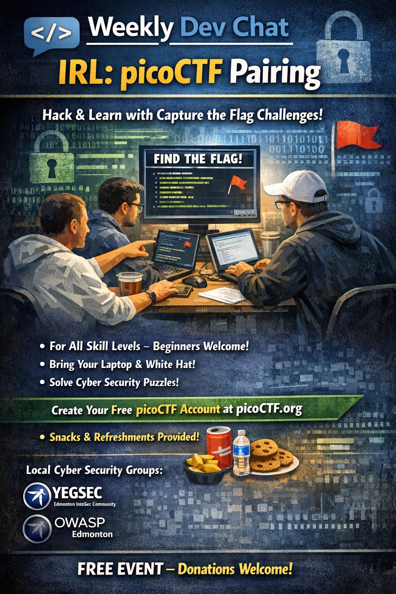

Join us for an in-person Weekly Dev Chat focused on solving picoCTF challenges together.

This event is designed for both experienced CTF players and people brand new to capture-the-flag challenges. We’ll pair up, help each other through problems, and practice practical cybersecurity skills in a friendly setting.

The event runs on Wednesday, April 22 from 7:00 PM to 8:30 PM at Edmonton Public Library - Strathcona.  Register and view full details on Luma:

[https://luma.com/jbjhkupb](https://luma.com/jbjhkupb)

*ChatGPT created the header image. Not bad but still has the unique AI feel to it.
