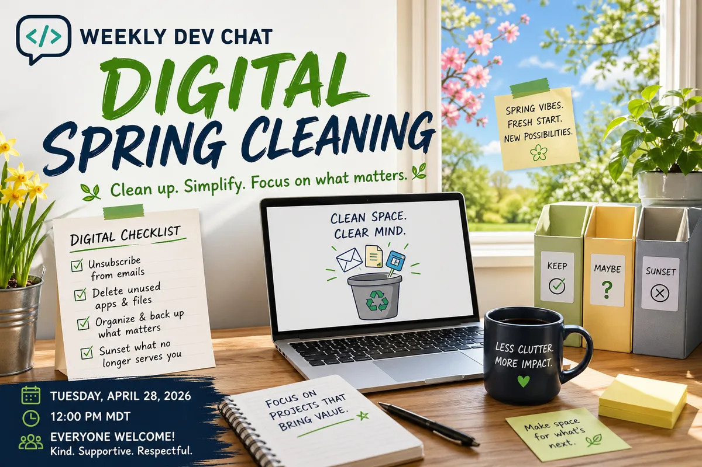

Spring* is finally here! Well, hopefully. With that comes the time for spring cleaning. For me, that means outdoor tasks like getting the BBQ cleaned, prepping the garden, trimming the trees, and cleaning windows. I also try to use this time for digital cleaning, like unsubscribing from emails I no longer read, deleting apps and files I don't need, and deciding which projects need to be sunsetted.

This week's (2026-04-28) chat topic is digital spring cleaning. Do you do a digital spring cleaning?  If so what do you delete, remove, and/or conclude?  If not, then when do you do your digital cleaning?  Are you one of those people that is constantly keeping your digital life clean and tidy?

Everyone and anyone is welcome to [join](https://weeklydevchat.com/join/) as long as you are kind, supportive, and respectful of others.

*For those not in the Edmonton (YEG) area, spring means no snow and above-freezing temperatures (0 Celsius, 32 Fahrenheit). As of this writing, the last snowfall was [April 26th](https://climate.weather.gc.ca/climate_data/daily_data_e.html?hlyRange=2012-04-10%7C2026-04-27&dlyRange=2012-04-12%7C2026-04-27&mlyRange=%7C&climate_id=3012216&Prov=AB&urlExtension=_e.html&searchType=stnName&optLimit=yearRange&StartYear=1840&EndYear=2016&selRowPerPage=25&Line=11&searchMethod=contains&Month=4&Day=21&txtStationName=edmonton&timeframe=2&Year=2026) at the airport.

**Image generated using ChatGPT.  I like the happy positive vibes from the image.

