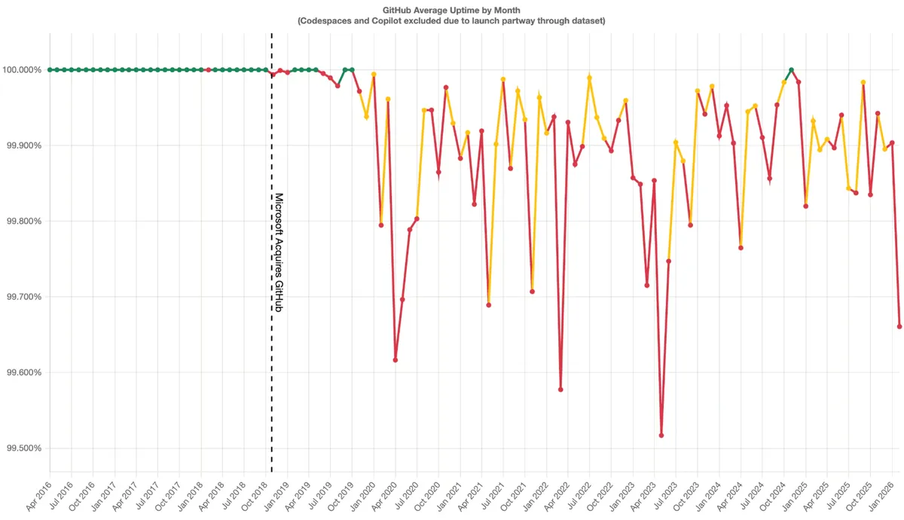

GitHub had quite a time last month: 

***April 23 (Merge Queue incident)**: A regression in the merge queue (especially with squash merges involving multiple PRs) caused incorrect merge commits. It affected 658 repositories and 2,092 pull requests. Changes from earlier merges were inadvertently reverted in some cases. No data loss occurred (commits were still in Git), but default branches ended up in inconsistent states for some repos. GitHub couldn’t auto-fix everything safely.*

***April 27 (Elasticsearch/search incident)**: The Elasticsearch cluster (used for search in PRs, issues, projects, etc.) became overloaded—likely from a botnet attack—and stopped returning results. This disrupted UI search features for several hours but didn’t affect core Git operations or APIs.*

Others have commented on their [recent decline](https://dbushell.com/2026/04/29/github-is-sinking) (see chart below).  Do you still trust them? Are you sticking with them, or exploring alternatives? Don’t forget... GitHub isn’t Git 😉  .

Everyone and anyone are welcome to [join](https://weeklydevchat.com/join/) as long as you are kind, supportive, and respectful of others. Zoom link will be posted at 12pm MDT.

