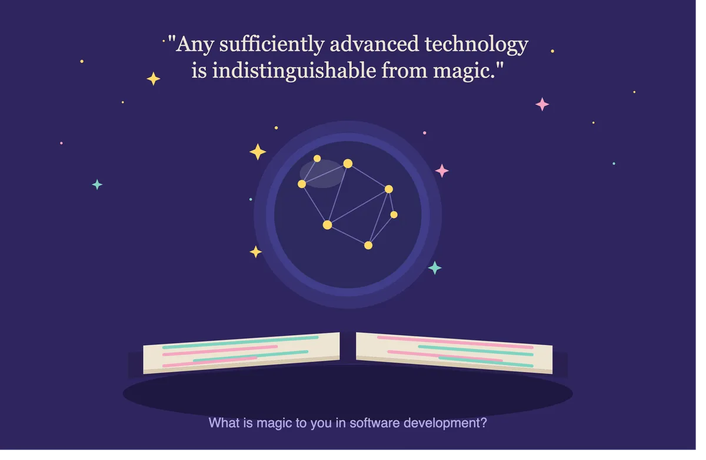

Arthur C. Clarke famously said: "Any sufficiently advanced technology is indistinguishable from magic."  What is your "this is magic" in software development?  Put another way what is something you currently don't understand but would like to?

As an older developer I'm struggling to fully understand LLMs and agents.  How do you train one?  Why are some agents/LLM models so much better then others?  I'm curious to hear what others struggle with.

Clarke's Three Laws: [https://en.wikipedia.org/wiki/Clarke%27s_three_laws](https://en.wikipedia.org/wiki/Clarke%27s_three_laws)

Everyone and anyone are welcome to [join](https://weeklydevchat.com/join/) as long as you are kind, supportive, and respectful of others. Zoom link will be posted at 12pm MDT.

P.S. - The featured image is from Claude Opus 4.8.  In my personal experence Claude is the best for development but horrible at images.  The output from Claude about the image made me laugh and reminds me of when a kid draws a picture and you have to sneakly ask them what it really is.

> Here's an illustration for your post—a wizard's crystal ball displaying a neural network and glowing nodes, resting on an open spellbook whose pages show streams of code. The Clarke quote sits at the top, with your discussion prompt anchoring the bottom, and magical sparks scattered throughout to tie the "technology as magic" theme together.

