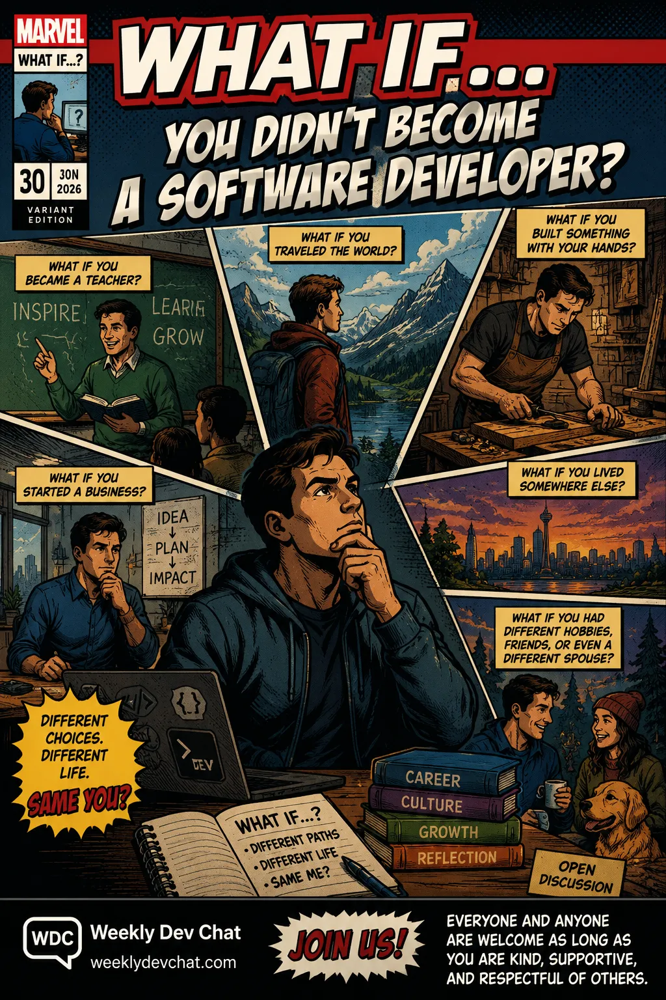

Think back to that one point in your life that put you on the path to being a software developer and now take an alternative path. Aside from your career how else would your life be different? Would the company(s) you worked for be better, worse, or the same? Would you live somewhere else? Different hobbies? Different friends and/or spouse(s)? What else do you think would be different or the same? 

Inspired by me going to visit relatives and wondering how my life would be different if we hadn't moved to Edmonton when I was a kid. Also by the popular Marvel [comics](https://en.wikipedia.org/wiki/What_If_(comics)) and TV [show](https://www.youtube.com/watch?v=x9D0uUKJ5KI).

Everyone and anyone are welcome to [join](https://weeklydevchat.com/join/) as long as you are kind, supportive, and respectful of others.

P.S. - The featured image was created with ChatGPT where i asked it to create image similar to the Marvel What If? covers.

