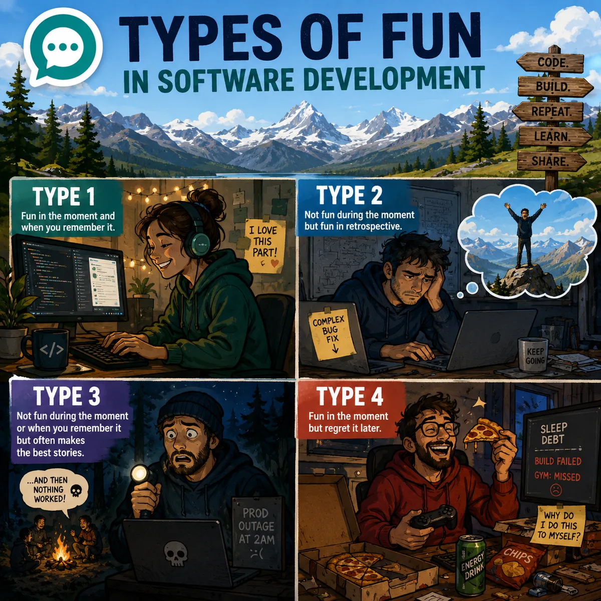

Today's (2026-07-21) topic is applying the types of fun to software development.  The [4 types](https://medium.com/@barkingdogx/the-fun-scale-the-origins-of-the-4-fun-types-ffd8508a6540) of fun are:

- Type 1: Fun in the moment and when you remember it.  
  Example: Stroll in the park on a nice day with friends.  Would do it again in a heartbeat.

- Type 2: Not fun during the moment but is fun in retrospect.  
  Example: Hike to the top of a mountain on a hot day with some great views at the top.  Get a feeling of accomplishment.

- Type 3: Not fun during the moment or when you remember it but often makes the best stories.  
  Example: Getting lost at night during a hike and your headlamp isn't working.  Holy crap, that was more dangerous than I thought.

There is also a 4th type of fun that some people have added:

- Type 4: Fun in the moment but regret it later.  
  Example: Eating and drinking too much.  Often counter to your long-term goals such as staying in shape.

What are some examples of the types of fun in Software Development?  Inspired by me recently spending six days hiking to and around [Mt. Assiniboine](https://www.hikethecanadianrockies.com/guides/assiniboine).  It was definitely type 2 fun due to the long days of hiking, the mosquitoes, and crappy dehydrated food but great to remember.

Everyone and anyone is welcome to [join](https://weeklydevchat.com/join/) as long as you are kind, supportive, and respectful of others.

P.S. - Image created by ChatGPT.

