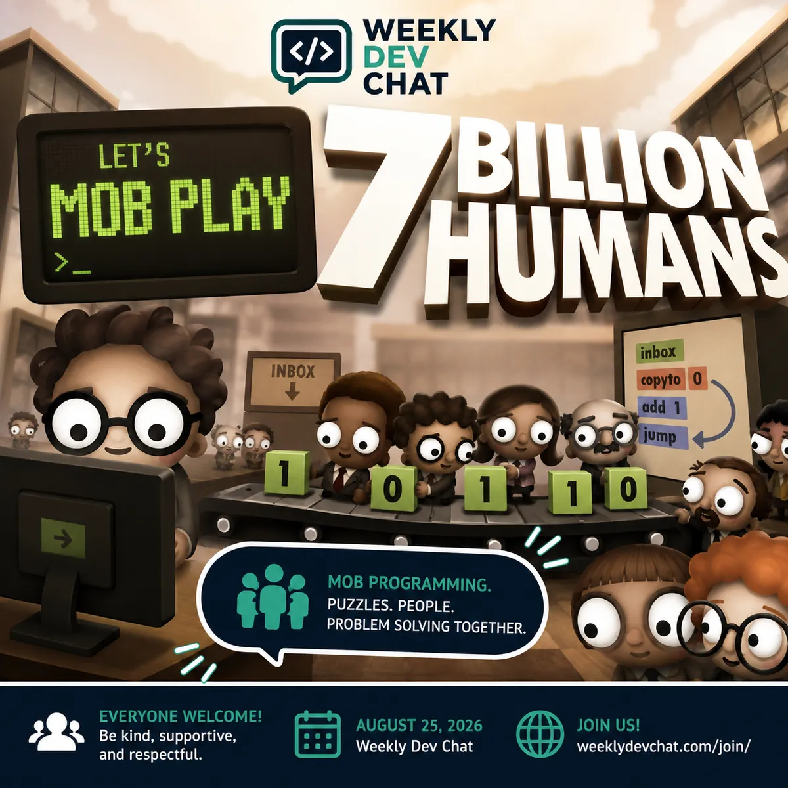

Today's (2026-08-25) chat is mob playing 7 Billion Humans.  From the publisher's website:

> Automate swarms of office workers to solve puzzles inside your very own parallel computer made of people.
>
>...a thrilling followup to the award winning Human Resource Machine. Now with more humans!

I'll share my screen and we can try to solve a couple of the puzzles together.  Learn more about the game at:

[https://tomorrowcorporation.com/7billionhumans](https://tomorrowcorporation.com/7billionhumans)

Everyone and anyone is welcome to [join](https://weeklydevchat.com/join/) as long as you are kind, supportive, and respectful of others.

P.S. - The image for this post was created by ChatGPT.  I asked it to create an image for this post, which I cut and pasted into the chat, and it produced the below.  No other tweaks needed.  I'm amazed at how much better image creation has gotten in the past couple of years.

