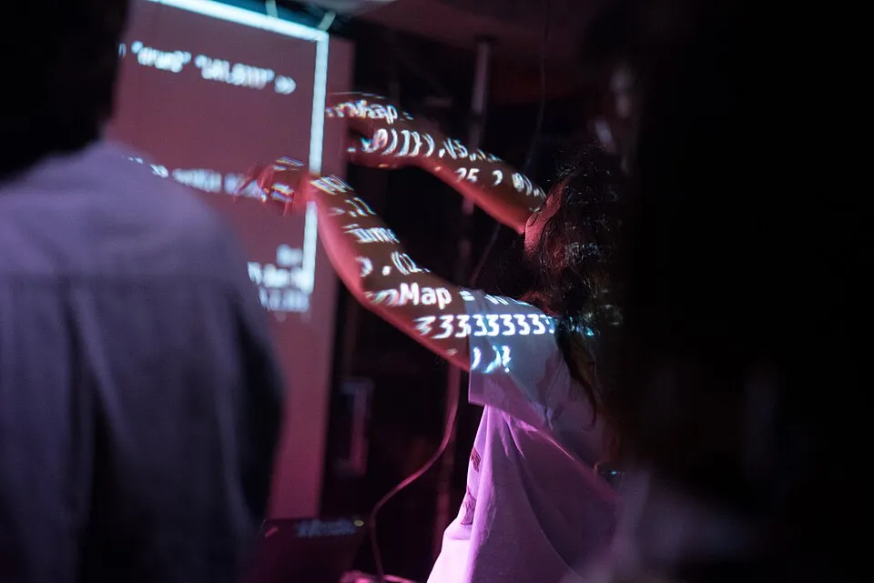

"Talk is cheap. Show me the code." Linus Torvalds' line assumed writing code was the hard part. With AI tools producing code faster than we can read it, maybe that's no longer true. So if code is cheap now, what's the scarce thing? Judgment? Taste? Tests? The spec? The review? Fill in the blank.

Do you actually review every line the AI writes for you? Be honest. Where do you draw the line between a throwaway prototype and production code? How do you manage your usage: budgets, limits, tasks you'll never hand off? And do you still get the kick from solving a problem yourself, or has the fun moved from writing code to directing it?

Everyone and anyone is welcome to [join](https://weeklydevchat.com/join/) as long as you are kind, supportive, and respectful of others. Zoom link will be posted at 12pm MDT.

